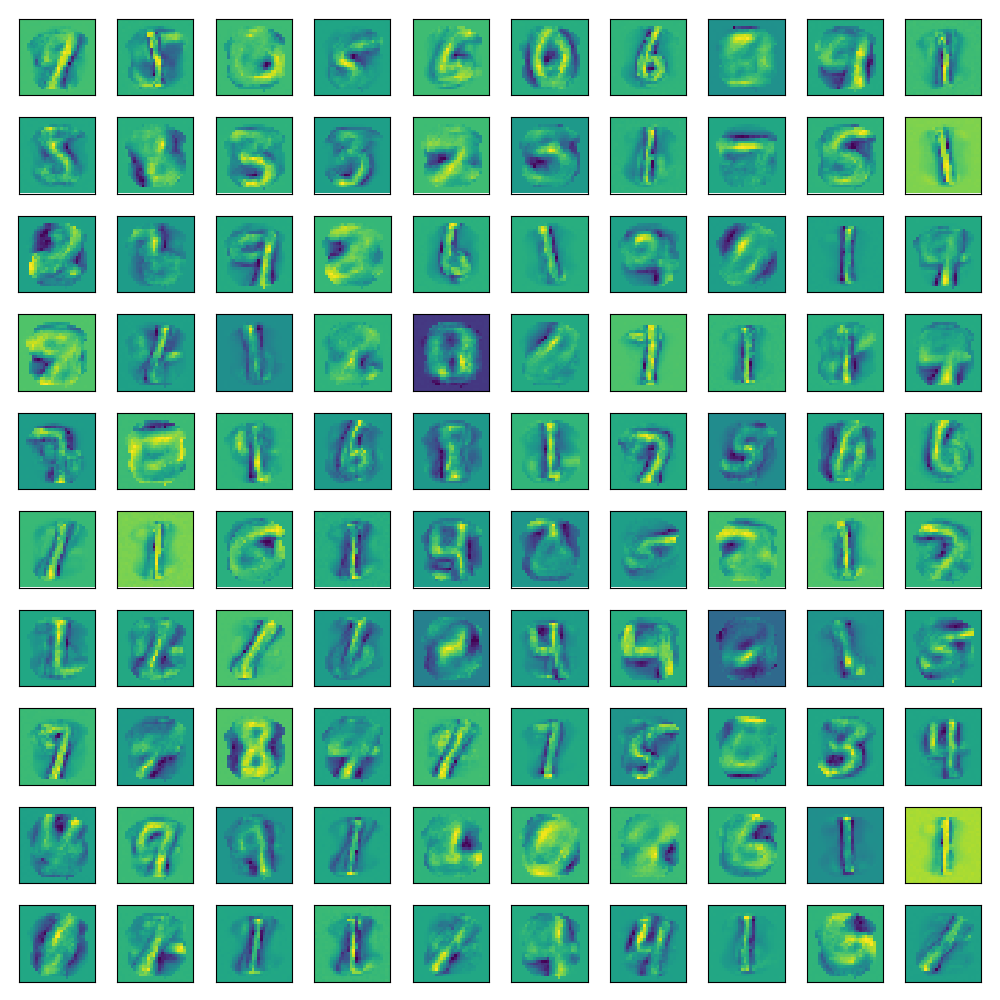

# Monte Carlo Restricted Boltzmann Machine

The latex in the second paragraph probably looks crappy here, but if you clone the repo and view this in a proper markdown viewer it should make sense.

driver.py trains a Restricted Boltzmann Machine autoencoder on the MNIST dataset by leveraging the reparameterization trick to compute a differentiable Monte Carlo approximation to the marginalization over the Bernoulli hidden state, allowing model parameters to be trained via gradient descent.

The reparameterization works by sampling a random normal variable $\xi \sim \mathcal{N}(), 1)$ and adding a constant $\mu$ such that $P(\xi + \mu > 0) = p(h_i = 1) = p$, where $h_i$ is the $i$th element of the hidden state and $p$ is the probability computed by the model. The appropriate $\mu$ is computed from the Q-function of a gaussian distribution with mean $\mu$ and variance 1 and is equal to $-\sqrt{2}*\textrm{erf}^{-1}(1-2p)$.  Denoting $x = \xi + \mu$, this is transformed into binary units by $h_i = \frac{x + \abs{x}}{2\abs{x}}$.

To run with standard parameters, open an ipython console and run `run driver.py`. After the script finishes and the model has trained, use the `plot_sample` function to see the autoencoder in action by viewing reconstructions against their originals (some examples shown below). The command line arguments are handled by argparse, so run `run driver.py -h` to see what parameters you can play with.

## Weight matrix columns reshaped as 28x28 images
</img>