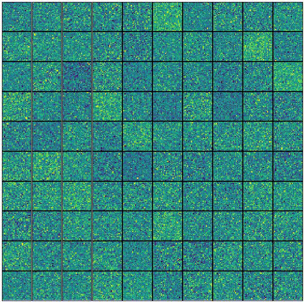
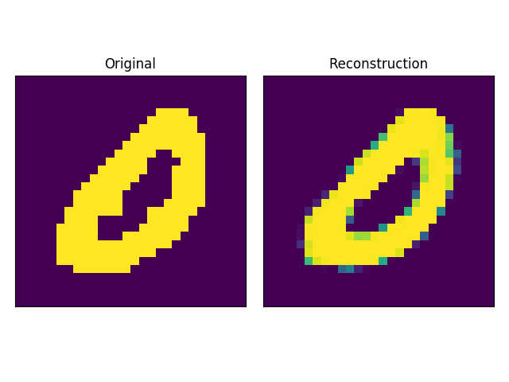
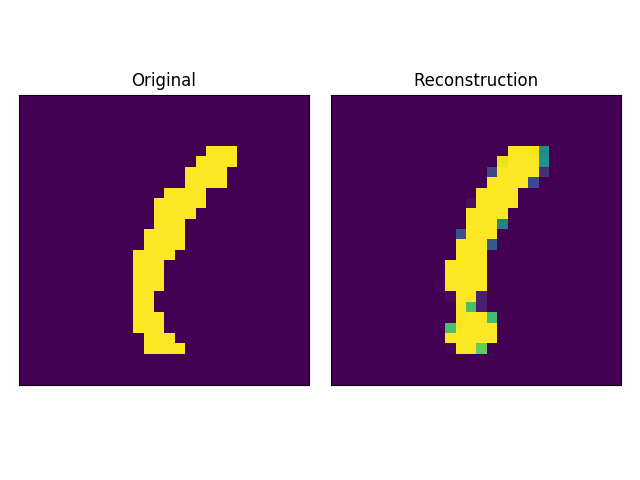
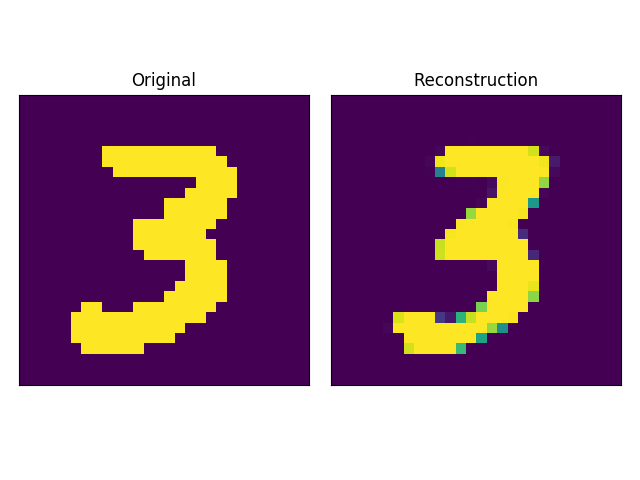
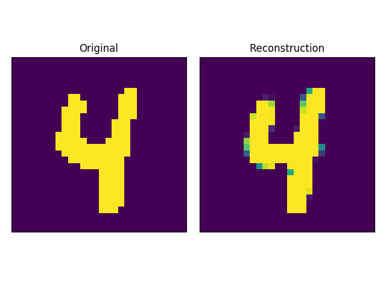

# Monte Carlo Restricted Boltzmann Machine

driver.py trains a Restricted Boltzmann Machine autoencoder on the MNIST dataset by Monte Carlo approximating the marginalization over the Bernoulli hidden state, allowing model parameters to be trained via gradient descent.

To run with standard parameters, open an ipython console and run `run driver.py`. After the script finishes and the model has trained, use the `plot_sample` function to see the autoencoder in action by viewing reconstructions against their originals (some examples shown below). The command line arguments are handled by argparse, so run `run driver.py -h` to see what parameters you can play with.

## Weight matrix columns reshaped as 28x28 images, evolving over training
</img>

## Originals vs. Reconstrutction
</img>
</img>
</img>
</img>