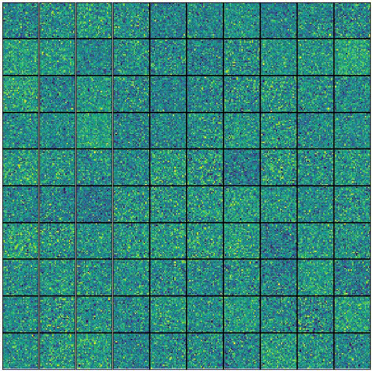

# Monte Carlo Restricted Boltzmann Machine

driver.py trains a Restricted Boltzmann Machine autoencoder on the MNIST dataset by Monte Carlo approximating the marginalization over the Bernoulli hidden state, allowing model parameters to be trained via gradient descent.

This started as an attempt to reparamterize Bernoulli sampling using the Q-function and standard normal random variables, but the gradients with respect to the sampling are necessarily 0 no matter how you parameterize it (as should be obvious). So now it's really just a demo of the use of the Keras backend as a standalone deep learning interface (though it still uses the optimizer and initialization modules, which I guess leverages the higher level API, but wouldn't be hard to replace), and a home for the weight-gif code, which I can imagine using in the future. It also suffers from the flaw that because of the 0 gradient with respect to the sampling, the `b` bias is not updated during training.  Accordingly, this should all probably just be updated to run contrastive divergence on all the parameters and be another boring RBM example. But where would the fun in that be?

To run with standard parameters, open an ipython console and run `run driver.py`. After the script finishes and the model has trained, use the `plot_sample` function to see the autoencoder in action by viewing reconstructions against their originals (some examples shown below). The command line arguments are handled by argparse, so run `run driver.py -h` to see what parameters you can play with.

## Weight matrix columns reshaped as 28x28 images, evolving over training
</img>

## Originals vs. Reconstrutction
</img>
</img>
</img>
</img>